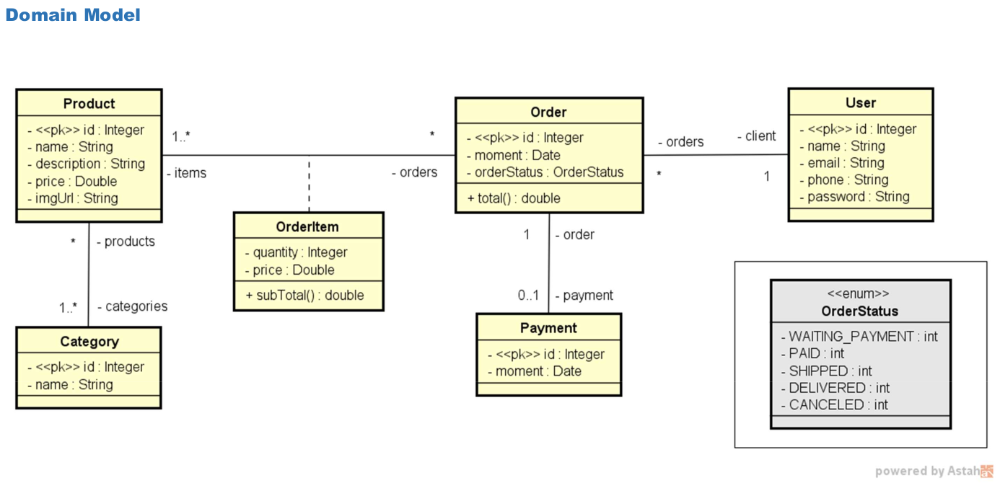

# workshop-springboot3-jpa

<h4 align="center"> 
	Projeto de pedidos de produto
</h4>

<p align="center">
 <a href="#-sobre-o-projeto">Sobre</a> •
 <a href="#-funcionalidades">Funcionalidades</a> •
 <a href="#-Configuração-do-ambiente">Configuração do ambiente</a> • 
 <a href="#-como-executar">Como executar</a> • 
 <a href="#-tecnologias">Tecnologias</a> 
</p>

---

## :ringed_planet: Sobre o projeto

Este projeto consiste em um back-end cujo propósito é organizar os pedidos realizados em uma loja. Para alcançar esse objetivo, foram empregados o framework Spring Boot e a tecnologia JPA/Hibernate.

---

## Diagrama


 
---

## 💻 Funcionalidades
 
- [x] **Administrado:**
  - [x] Visualizar dados dos clientes;
  - [x] Visualizar dados dos pedidos;
  - [x] Visualizar dados dos produtos;
  - [x] Visualizar dados das categorias;
  - [x] Adicionar cliente;
  - [x] Remover cliente;
  - [x] Atualizar informações do cliente.

## 🎨 Configuração do ambiente

### Linux (Ubuntu)

#### Java 17 

```bash

# Instalação da JDK 17

## Comando de instalação do SDKMAN

curl -s "<https://get.sdkman.io>" | bash

## Após instalar o SDKMAN, utilize o comando a seguir para instalar o JDK 17:

sdk install java 17-open

## Certifique-se de que o JDK foi instalado corretamente utilizando o comando:

java --version

# Instalação do Maven 

## Para instalar o Maven, utilize o seguinte comando:

skd install maven 3.1.5

## Verifique a instalação do Maven com o seguinte comando:

mvn --version
 
# Instalação do STS

## Para instalar o Spring Tool Suite (STS), acesse o site oficial, faça o download e instale a versão compatível com o seu ambiente de desenvolvimento.

https://spring.io/tools

```

## 🚀 Como executar

### Pré-requisitos

Ter feito a configuração do ambiente.

### Execução

- Executar o STS

- Clicar no arquivo Program.java e depois clicar na opção run

- Porta de acesso: http://localhost:8080/

## 🛠 Tecnologias

### **Back-End**

- **[Java](https://docs.oracle.com/en/java/)**
- **[Spring Tools (STS)](https://spring.io/tools)**
- **[Spring Framework - Documentação](https://glysns.gitbook.io/spring-framework/)**
- **[Banco de dados h2](https://www.h2database.com/html/main.html)**